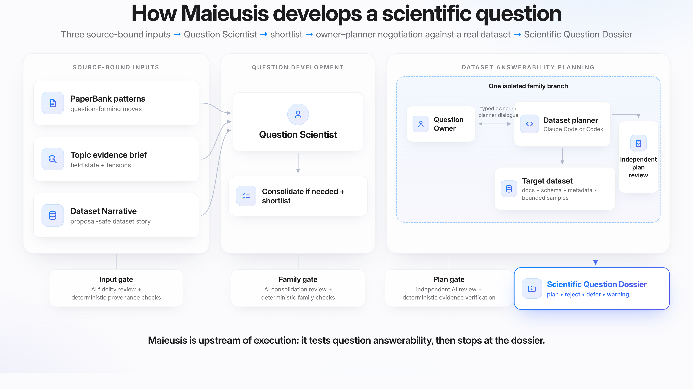
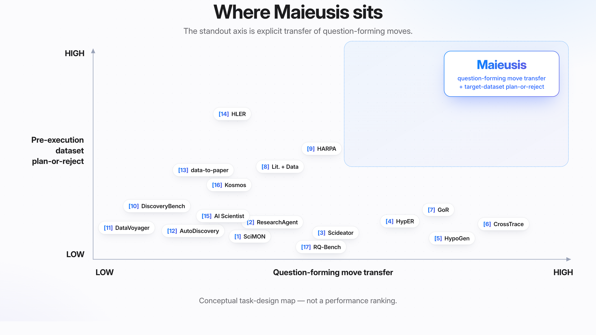
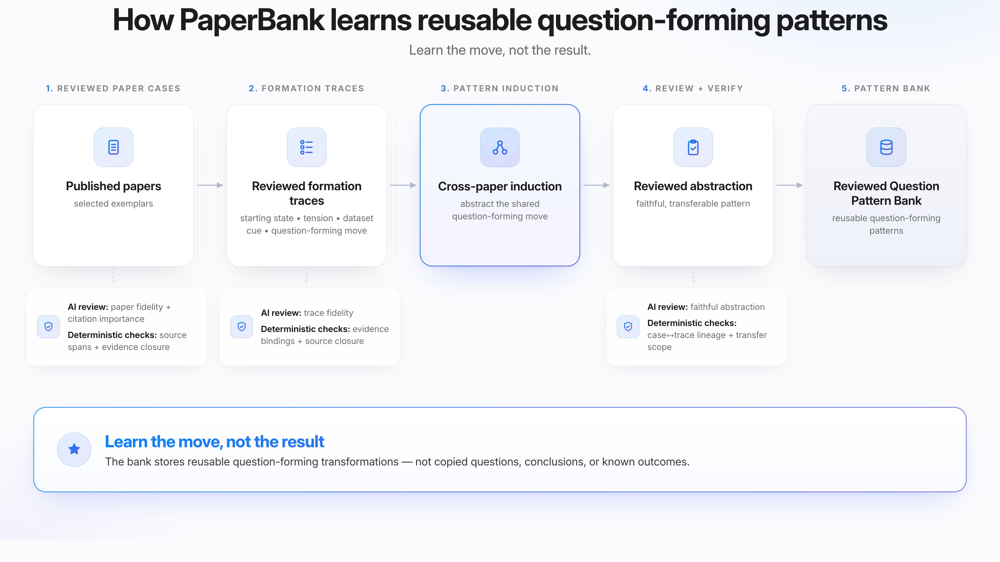

# Maieusis

**Maieusis turns the ways prior papers form scientific questions into reusable,
source-backed patterns. Before any full analysis, it tests new question
families against a real target dataset and produces a plan, a revision, or an
honest rejection.**

Maieusis is an agent-operated tool for developing research questions, not an
analysis executor. Its primary result is an inspectable Markdown scientific
dossier with human-readable intermediate products and a provenance trail.

> **Research Preview · v0.1.0.** Do not treat an output as a scientific
> finding, a guarantee of novelty, or permission to run a confirmatory
> analysis. The downstream analysis-execution bridge is closed.

<p align="center">
  
</p>

<p align="center"><em>Three source-bound inputs become distinct question families; every shortlisted family enters an isolated Owner–Planner branch against the real target dataset and closes as plan, reject, defer, or warning before execution.</em></p>

## Fastest start: ask a coding agent

Install Maieusis, create a clean project directory, then paste this into Codex
or Claude Code:

```text
Help me run Maieusis v0.1.0 in this clean project directory.
1) First run `maieusis init`.
2) Then read the newly created AGENTS.md, CLAUDE.md, PROJECT_LAYOUT.md, and
   maieusis.yaml. Do not assume that this project contains a cloned Maieusis
   repository README.md or docs/ tree.
3) Help me place only lawfully obtained source-paper PDFs in papers/inbox.
4) Configure a read-only target dataset root, its official link/docs, and a
   source checkout for the Dataset Planner.
5) Choose Codex or Claude Code as the coding host.
6) Store API keys only in ~/.config/maieusis/runtime.env, never in YAML.
7) Edit maieusis.yaml without inventing dataset facts.
8) Run `maieusis check` and resolve every zero-paid preflight error.
9) Show me the estimated calls and ask before starting `maieusis run`.
10) After the run, open summary.md and the per-family end-user dossiers.
Do not execute scientific analyses, access confirmation outcomes, or weaken a
provenance/security check.
```

Detailed beginner instructions: [agent-guided setup](docs/AGENT_GUIDED_SETUP.md).

## Manual quickstart

Requires Python 3.11, a Git client, a coding-agent host, at least one supported
frontier model API, a real dataset repository/sample, and lawful access to the
papers you choose.

```bash
python3.11 -m venv .venv
source .venv/bin/activate
python -m pip install --upgrade pip
python -m pip install "maieusis[mcp,pdf,openai,anthropic]==0.1.0"

mkdir my-maieusis-project
cd my-maieusis-project
maieusis init
# Add PDFs under papers/inbox and edit maieusis.yaml.
maieusis check --project maieusis.yaml   # zero paid calls
maieusis run --project maieusis.yaml
```

The CLI also provides:

```bash
maieusis status <run-id> --project maieusis.yaml
maieusis resume <run-id> --project maieusis.yaml
```

Read [installation](docs/INSTALLATION.md),
[manual setup](docs/MANUAL_SETUP.md), and the
[configuration reference](docs/CONFIGURATION.md) before a paid run.

## Why this is different

Most literature assistants retrieve papers or generate ideas; many autonomous
science systems begin executing once an objective is supplied. Maieusis
concentrates on the missing middle: it makes **question-forming moves** explicit
and then asks whether each proposed question can be responsibly planned on the
user's actual dataset *before* full analysis.

<p align="center">
  
</p>

<p align="center"><em>A task-design map, not a performance ranking. Every numbered placement has an adjacent source and rationale.</em></p>

The positioning map uses only two axes—explicit transfer of question-forming
moves and pre-execution target-dataset plan-or-reject. It is a task-design
comparison, **not a performance ranking**. See the
[one-by-one literature audit](docs/positioning/POSITIONING.md).

## Learn the move, not the result

PaperBank builds evidence-bound reconstructions of how selected papers moved
from a published starting state and tension to a question. Formation traces do
not claim to recover authors' private thought processes. PaperBank then induces
and independently reviews reusable question-forming patterns across papers.
The bank stores the transformation, not copied questions, conclusions, or
known outcomes. Users provide lawfully obtained source PDFs; Maieusis and its
public demos do not distribute them.

<p align="center">
  
</p>

<p align="center"><em>Evidence-bound traces preserve published-source lineage while PaperBank abstracts reusable moves; they are not reconstructions of private author thought, and source PDFs are not distributed.</em></p>

## What goes in and what comes out

| Input | Purpose | Human-readable output |
| --- | --- | --- |
| Source-paper PDFs | Build evidence-bound reconstructions of published question formation | PaperCases, key-citation decisions, formation traces, patterns |
| Topic terms or an optional seed question | Express the research direction without hard-filtering feasibility | Research intent and current topic-evidence brief |
| Dataset link, documentation, metadata, and a read-only local sample | Give coarse proposal context, then support exact branch-local inspection | DatasetNarrative and dataset-grounded planning evidence |
| Frontier model API(s) and Codex or Claude Code | Operate scientific roles and inspect the target dataset | QuestionFamilies, typed dialogue, plan/reject closure, review |
| A completed run | Preserve every outcome at its earned authority | `summary.md` plus compact and detailed per-family dossiers |

The readable intermediate artifacts are a feature: you can inspect what a
paper contributed, how patterns were induced, what every proposed variant
meant, what the planner observed, and why a family advanced or stopped.
Local runs also retain machine manifests, receipts, and hidden audit sidecars
for integrity and recovery. Public demos include only allowlisted
human-readable scientific artifacts; private receipts, hidden sidecars, raw
captures, and session/request identifiers are not published.

## Reproducible demos

Direct reproduction guides: [IBL Brain Wide Map](demos/ibl/README.md) ·
[NLB MC Maze](demos/nlb/README.md).

Start with the [question gallery](demos/QUESTIONS.md) for a scientific tour of
all twelve final families and their variants, then follow its links into the
curated intermediate artifacts and compact/detailed dossier pairs. The public
demo trees contain no source PDFs, raw model captures, or hidden audit
sidecars.

| Demo | Target dataset | What it contains |
| --- | --- | --- |
| [IBL Brain Wide Map](demos/ibl/README.md) | IBL BWM | Paper manifest and acquisition instructions, final configuration, readable PaperBank/context/family artifacts, and six compact/detailed dossier pairs |
| [NLB MC Maze](demos/nlb/README.md) | DANDI `000140` | Receipt-bound PaperBank reuse, newly generated dataset/topic/family/planning artifacts, five accepted dossier stacks, and one explicit validation-warning dossier without accepted-plan authority |

### Featured question: which shared-variability dimensions matter for decisions?

Large shared fluctuations are not automatically decision-relevant. The IBL
family asks whether the *orientation* of population variability relative to
decision geometry predicts choice and response-time variation better than its
overall magnitude—and whether measured pose and ongoing behavioral state offer
a stronger explanation. Both variants reached provisional accepted planning
outcomes; these are analysis plans, not scientific results.

Read the [full proposal background and both variants](demos/ibl/artifacts/questions/question_families_detailed.md#family-002-which-shared-variability-dimensions-matter-for-decisions),
the [scientific reading guide](demos/ibl/artifacts/families/covariance-alignment/dossier_detailed.md),
or the [complete planning dossier](demos/ibl/artifacts/families/covariance-alignment/dossier.md).

### Featured question: which geometric stability supports generalization in reaching?

Within-condition reproducibility and transfer across reach demands are not the
same form of stability. The NLB family asks whether M1 and PMd preserve
relational reach geometry despite changing population centroids, and whether
geometry transfers between straight and curved reaches or instead remaps by
demand. Both variants reached provisional accepted planning outcomes; no
analysis was executed.

Read the [full proposal background and both variants](demos/nlb/artifacts/questions/question_families_detailed.md#family-006-which-geometric-stability-supports-generalization-in-reaching),
the [scientific reading guide](demos/nlb/artifacts/families/geometry-definition-generalization/dossier_detailed.md),
or the [complete planning dossier](demos/nlb/artifacts/families/geometry-definition-generalization/dossier.md).

These highlights are entry points, not a ranking or the full scientific
output. **Continue to the [complete question gallery](demos/QUESTIONS.md) to
inspect all 12 families and all 24 variants**, including scientific background,
positive/negative/null interpretations, assumptions, planning outcomes, and
the NLB validation-warning family.

## Method, provenance, and limits

- [Method overview](docs/METHOD_OVERVIEW.md)
- [Architecture and trust boundaries](docs/ARCHITECTURE.md)
- [Inputs, outputs, and run layout](docs/INPUTS_AND_OUTPUTS.md)
- [Provenance and audit model](docs/PROVENANCE.md)
- [Limitations](docs/LIMITATIONS.md)
- [Related-work positioning](docs/positioning/POSITIONING.md)
- [Troubleshooting](docs/TROUBLESHOOTING.md)

Maieusis is designed for any discipline and any dataset that a coding agent can
inspect safely. We are currently working with collaborators to test applications
in climate science, physics, astronomy, finance, social science, and psychology,
alongside the neuroscience demos. This is ongoing evaluation, not a claim of
completed cross-disciplinary validation. Researchers from all fields are
welcome to try the system and contact `dracoxu@uchicago` for help or
collaboration.

## Citation and license

The software is Apache-2.0 licensed. Copyright 2026 Yunlong Xu. Software authors
are [Draco (Yunlong) Xu](https://orcid.org/0000-0003-2589-7232) and
[Brent Doiron](https://orcid.org/0000-0002-6916-5511).

Use [CITATION.cff](CITATION.cff) for the exact software citation. The
version-specific Zenodo software DOI will be added after the immutable v0.1.0
GitHub release is archived; no DOI is invented in advance. A technical report
is planned within one week of the first public release and will receive a
separate DOI and preferred citation.

See [LICENSE](LICENSE), [NOTICE](NOTICE), [AUTHORS.md](AUTHORS.md), and
[LICENSE_POLICY.md](LICENSE_POLICY.md).
