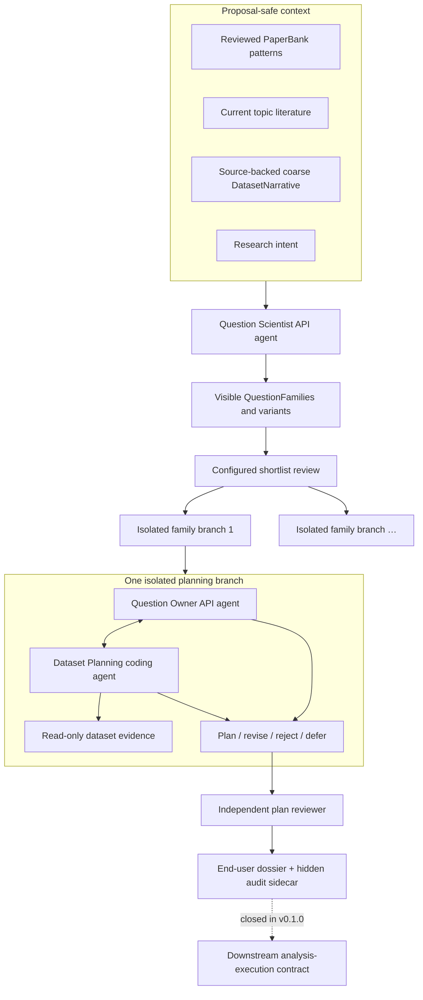

# Architecture and trust boundaries

Maieusis is a portable, agent-operated question-development system. Dataset-
specific semantics stay behind input/adaptor boundaries; IBL and NLB are demo
targets, not assumptions in the core.

## The information firewall

The Question Scientist may see only four separated context families:

- reviewed PaperBank question patterns;
- current topic literature evidence;
- the coarse DatasetNarrative; and
- research intent.

It must not see exact table/column schema, precise joint coverage, target-result
search, confirmation outcomes, planner receipts, negative benchmark answers,
or full raw review/source dumps. This firewall prevents proposal from becoming
a disguised search over what is easiest or already known to work.

Once a family exists, the Dataset Planner may inspect exact target-dataset
facts. It cannot run a full scientific analysis, optimize against target
outcomes, access a confirmation set, or claim a result.

## Scientific roles

| Role | Authority | Cannot do |
| --- | --- | --- |
| Lead coding-agent host | Operates files, tools, providers, branches, validation | Treat its own prose as scientific evidence |
| Question Scientist | Proposes ambitious families from proposal-safe context | Certify target feasibility or novelty |
| Question Owner | Protects scientific intent and judges operational meaning | Certify dataset facts without planner evidence |
| Dataset Planner | Inspects real dataset context and proposes grounded plans | Execute the full analysis or silently change the question |
| Independent reviewer | Challenges intent drift, grounding, overclaim, controls | Reuse hidden generator state as “independence” |
| Human expert | Optional post-hoc scientific checkpoint | Required only for a future execution-bridge authorization |

## Isolation and typed state

Each shortlisted family receives its own branch, owner session, planning
workspace, evidence, dialogue, and closure. Family branches do not share hidden
model state or variant-specific evidence. Shared resources are limited to
reviewed static artifacts such as the PaperBank, topic brief, DatasetNarrative,
domain pack, and public documentation.

Owner/planner dialogue is typed and replayable: every turn carries a message
type, actor, branch identity, family or variant scope, provenance, and payload
digest. Provider session IDs are not the source of truth.

## Closure and execution boundary

Valid branch outcomes include accepted plans, accepted plans needing a new
skill, dataset mismatch, operationalization failure, scientific drift, or
honest escalation/defer. The run attempts every selected family and summarizes
all outcomes; a rejected family is scientific information, not infrastructure
failure.

v0.1.0 ends at the scientific dossier. It does not create a downstream
analysis-execution contract or invoke an analysis executor. That bridge requires
a later explicit human authorization and is not unlocked by a model, config
flag, accepted dossier, or demo.
