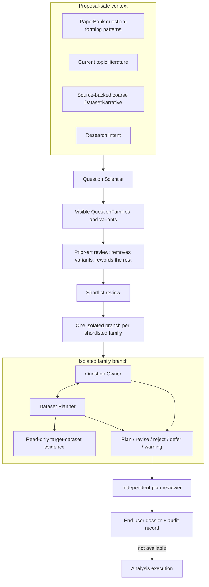

# Architecture and trust boundaries

[Documentation home](INDEX.md) · [Method overview](METHOD_OVERVIEW.md)

Maieusis is an agent-operated scientific question-development system. Dataset-
specific semantics remain behind input and inspection boundaries; the
International Brain Laboratory (IBL) Brain-Wide Map and Neural Latents
Benchmark (NLB) MC_Maze-S datasets are examples, not assumptions built into the
core.

## Two coding-agent responsibilities

The coding agent appears in two related but distinct places:

- The **lead coding-agent session** helps the user configure and operate the
  project, invokes the CLI, and presents the resulting artifacts.
- The **Dataset Planner** is launched by Maieusis for one family in an isolated
  workspace. It inspects the configured dataset and writes only branch-scoped
  planning evidence and plans.

They may use the same Codex or Claude Code product, but a lead session's prose
is not scientific evidence, and one planner branch cannot borrow hidden state
or variant-specific evidence from another.

## The proposal information firewall

Before a question is proposed, the Question Scientist receives four separated
context families:

- PaperBank question-forming patterns with their earned authority;
- current topic-literature evidence;
- a coarse, source-backed DatasetNarrative; and
- the user's research intent.

It does not receive exact table or column schemas, precise joint coverage,
target-result searches, confirmation outcomes, planner receipts, negative
benchmark answers, or unrestricted raw source/review dumps. This prevents
proposal from becoming a disguised search for what is easiest or already known
to work.

After a family has been proposed and shortlisted, its Dataset Planner may
inspect exact target-dataset facts. That planner still may not run the full
scientific analysis, optimize against target outcomes, access a confirmation
set, or claim a result.

## Scientific roles and authority

| Role | What it may establish | Boundary |
| --- | --- | --- |
| Lead coding-agent session | Correct operation of files, commands, tools, and visible workflow | Its own prose is not scientific evidence |
| Question Scientist | Candidate families and scientifically distinct variants from the allowed proposal context | Cannot certify dataset feasibility, novelty, or truth |
| Prior-art reviewer | That a candidate variant is, or is not, distinguishable from a resolved published prior; and the rewording that would distinguish it | Cannot establish that a question is novel — no bounded search proves absence — and cannot judge whether the dataset can answer it |
| Question Owner | The scientific meaning that a family or variant must preserve | Cannot certify dataset facts without planner evidence |
| Dataset Planner | Dataset-grounded operationalization and a non-executable analysis plan | Cannot execute the full analysis or silently change the question |
| Independent reviewer | A separate critique of intent, grounding, controls, overclaim, and revision | Does not establish empirical truth or replace a human expert |
| Human expert | Optional post-hoc scientific assessment of importance, constructs, and usefulness | Explicit human authorization would be required for any future execution bridge |

No role can promote an artifact above the authority of its supporting evidence
simply by changing a label.

## Isolation and persisted state

Each shortlisted family receives its own owner session, planner workspace,
evidence set, dialogue, and closure. Branches do not share hidden model state or
variant-specific evidence. They may share reviewed static resources such as
PaperBank patterns, the topic brief, the DatasetNarrative, a domain pack, and
public documentation.

Owner–Planner dialogue is typed and replayable. Each turn records the actor,
branch, family or variant scope, message type, provenance, and content digest.
Provider conversation IDs are operational references, not the authoritative
scientific state; persisted project artifacts are.

## Scientific outcomes versus software failures

A valid family outcome can be:

- an accepted plan;
- a plan that needs a new analysis skill;
- rejection because the dataset cannot support the question;
- rejection because no faithful operationalization was found;
- rejection because revision drifted from the scientific intent;
- deferment or optional human escalation; or
- a readable warning after a recoverable provider or validation problem.

These outcomes preserve what was learned and do not imply that the system
failed to run. Evidence, identity, source-tree, filesystem, branch-isolation,
or confirmation-firewall violations are different: affected content cannot be
trusted or promoted, and the run remains incomplete.

## The execution boundary

Maieusis v0.1.1 ends at the scientific question dossier. An accepted dossier
is still a plan, not an analysis contract or result. No model output, config
change, demo, or accepted plan can authorize downstream analysis execution.

See [limitations](LIMITATIONS.md) for the practical consequences and
[provenance](PROVENANCE.md) for how these boundaries are recorded.

---

[Documentation home](INDEX.md) · [Method overview](METHOD_OVERVIEW.md) ·
[Provenance](PROVENANCE.md) · [Limitations](LIMITATIONS.md)
